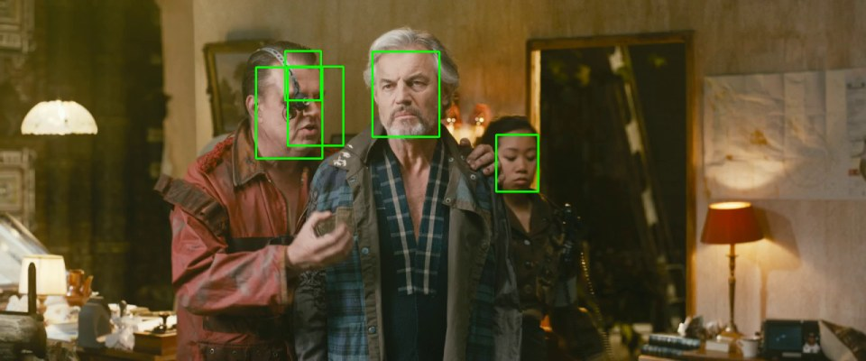
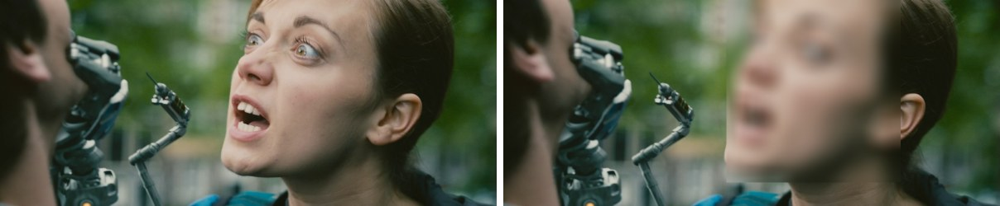

# face-scan-cli

A small command line tool that scans a video, finds every face in it, and
builds a report. It can also write a copy of the video with all faces blurred,
which is useful any time footage needs to be shared without exposing the
people in it.



*The busiest frame of the test film, marked up by the tool. Note the two
overlapping boxes on the left-hand face: the detector fires more than once on
a face at an angle, and the tool does not yet merge overlapping boxes, so that
frame's count of five is really four people. See
[Known limitations](#known-limitations).*

## What it does

1. Walks through the video and samples one frame out of every N.
2. Runs the MTCNN face detector on each sampled frame.
3. Draws a green box around every face and saves the marked-up frames.
4. Prints a report of what it found.
5. Optionally writes a face-blurred copy of the whole video.

## Example

Scanning the full 12 minutes of
[Tears of Steel](https://mango.blender.org/) (Blender Foundation, CC BY 3.0):

```
python facescan.py tears_of_steel_720p.mov --skip 30
```

```
scanning tears_of_steel_720p.mov (1 frame in every 30)...

--- report ---
frames in video      : 17620
frames scanned       : 588
faces found          : 491
average faces/frame  : 0.84
busiest frame        : results/faces/frame_004650.jpg (5 faces)
small faces (<65px)  : 195 (39.7%)
```

Nearly 40% of those detections were under 65px wide, which is the kind of
thing the report exists to surface. "491 faces" on its own would suggest the
footage is far more usable than it actually is.

## Privacy blur

`--blur` writes a copy of the whole video with every detected face blurred out,
so footage can be shared without exposing the people in it:

```
python facescan.py tears_of_steel_720p.mov --blur
```



*Original on the left, `--blur` output on the right.* Unlike the scan, this
mode looks at every single frame rather than sampling.

## Install

```
pip install -r requirements.txt
python facescan.py path/to/video.mp4
```

The first run downloads the MTCNN model weights automatically.

## Options

| Flag | Meaning | Default |
|------|---------|---------|
| `--skip N` | keep 1 frame out of every N | 30 |
| `--out DIR` | where results are written | results |
| `--min-face N` | faces narrower than N px count as small | 65 |
| `--save-frames` | also keep the raw sampled frames | off |
| `--blur` | also write a face-blurred copy of the video | off |
| `--json FILE` | also write the report as JSON | off |

## Layout

```
facescan.py             the whole tool: helpers, scan_video, blur_video, CLI
requirements.txt        what to install
tests/test_facescan.py  unit tests for the pure logic
docs/                   the images used in this README
```

## Tests

The report maths, the filename logic and the box clamping are pure functions
with no OpenCV in them, so they are tested without needing any video or model:

```
python -m pytest tests/
```

They also run without pytest installed:

```
python tests/test_facescan.py
```

## Things I learned building this

**Sampling is the decision that matters most.** I measured it properly before
picking a default. On a 4,566 frame clip:

| `--skip` | frames looked at | faces found | time |
|---|---|---|---|
| 1 | 4,566 | 4,186 | 295.6s |
| 15 | 305 | 266 | 25.9s |
| 30 | 153 | 126 | 16.0s |
| 150 | 31 | 30 | 7.6s |

Scanning every frame took 18x longer than scanning one in 30, for faces that
were mostly the same people again a fraction of a second later. Skipping 150
was fast but missed anyone who was only on screen briefly. One frame per
second is the balance I settled on, so `--skip 30` is the default.

**BGR versus RGB is the bug I would not have found on my own.** OpenCV loads
frames as BGR and the detector expects RGB. Get it wrong and nothing crashes,
detection just quietly gets worse, so there is nothing to trace back from.

**Reading a video is one loop with one exit condition.** `cap.read()` returns
`(False, None)` once there is no next frame, and that return value is the
entire reason the loop stops.

**A video that will not open looks exactly like an empty one.** Both give you
`False` on the very first read, so without an `isOpened()` check a missing
codec is reported as a video with zero frames in it. That one cost me time.

**Small faces are not the same as faces.** Anything under about 65px wide is
usually too blurry to do anything with, so the report counts those separately
instead of letting them inflate the total. In the test film above they were
almost 40% of every face found.

**Boxes can run off the edge of the frame** when a face is half out of shot,
and slicing a NumPy array with out-of-range numbers does not raise, it just
hands back a smaller crop than you asked for. So every box gets clamped to the
frame first. This is `clamp_box`, and it is the one piece of the tool that has
tests written specifically because the failure is silent.

**The blur has to look at every frame.** The scanner samples because a report
can afford to, but a blur that switches off for 29 frames out of 30 protects
nobody. Same detector, deliberately different loop.

## Known limitations

Worth being straight about what this does not do yet:

- **Overlapping boxes are not merged.** The detector can return two or three
  boxes for one face when it is turned away or partly covered, and every one
  of them is counted. This is visible in the first image above, and it means
  face counts are an upper bound rather than a count of people.
- **It counts faces, it does not recognise them.** The same person walking
  through forty frames is forty faces, not one person seen forty times.
- **CPU only, so it is not real time.** Detection is the bottleneck, at
  roughly 15 frames per second on my machine. Sampling is what makes it
  practical, not raw speed.
- **The blur is a rectangle**, so it has hard edges and covers a little more
  than the face itself.

## Notes

The example is reproducible: [Tears of Steel](https://mango.blender.org/) is
released under CC BY 3.0 and the 720p file is a
[direct download](https://download.blender.org/demo/movies/ToS/tears_of_steel_720p.mov).
It is a useful test case because it is live action, so there are real faces in
it, and because anyone can run the same command and check the numbers.

Video files and generated frames are kept out of git by the `.gitignore`, so
the tool is safe to run inside this folder.

## Credits

The images and the example report in this README come from
[Tears of Steel](https://mango.blender.org/), (CC) Blender Foundation, used
under [CC BY 3.0](https://creativecommons.org/licenses/by/3.0/).

## License

MIT, see [LICENSE](LICENSE).
